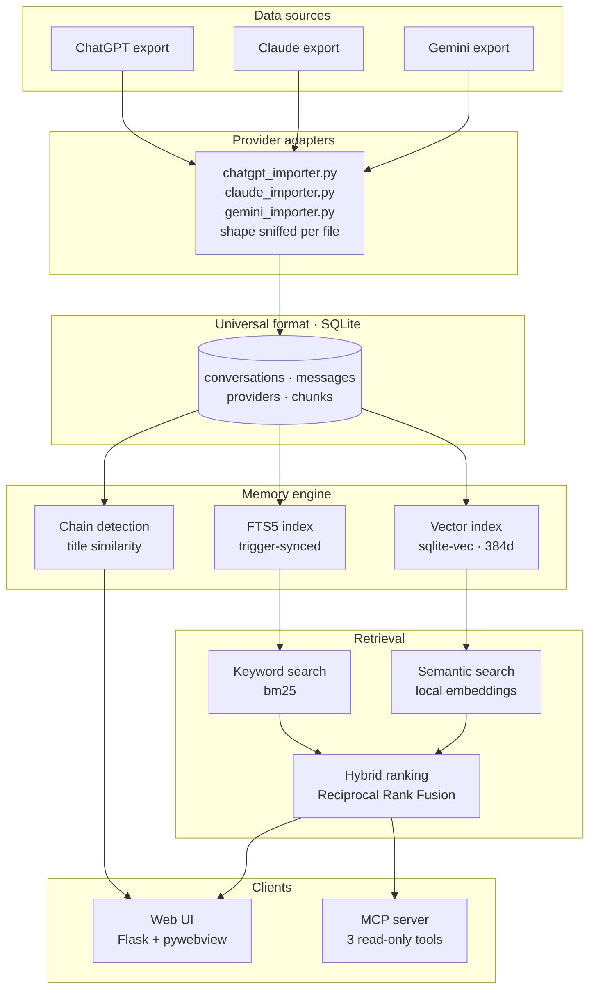

# ContextVault


**A local-first memory layer for your AI conversations. Search everything you
have ever asked — by keyword and by meaning — without any of it leaving your
machine.**

## The problem

*"I remember discussing this. I have no idea which session it was in."*

You worked out a deployment strategy with an assistant three months ago. You
remember the conclusion. You cannot remember the wording, the title, or the
day. So you scroll — and the sidebar only shows titles, most of them
auto-generated and useless. "Project discussion." "New chat." "Untitled."

The conversation is right there. You just cannot find it. Your most useful
thinking is locked in a list you can only search by the one field that carries
the least information.

## The solution

ContextVault imports your exported chat history into a single SQLite file on your
own machine and makes all of it searchable.

Two engines run over it at once. **Keyword search** finds the words you
actually typed. **Semantic search** finds the conversation when you cannot
remember a single word of it — matching on meaning, using embeddings computed
locally. Results are merged, deduplicated, and badged so you can see which
engine found what.

## Demo

Both of these searches return the same conversation — one titled simply
*"Welcome"*, whose text never contains the phrase you searched for:

```
$ search "gym workout"

  Welcome                                             [both]  1 message match
  ChatGPT · 23 Aug 2024 · 4 messages
  "I want to build muscle and start going to the gym. What should my
   workout plan look like for a beginner?"
```

Fair enough — those words are in the text. Now the one keyword search cannot do:

```
$ search "how do I get stronger"

  Welcome                                     [semantic]  39% similar
  ChatGPT · 23 Aug 2024 · 4 messages
  "I want to build muscle and start going to the gym. What should my
   workout plan look like for a beginner?"
```

Not one word of *"how do I get stronger"* appears anywhere in that
conversation. Keyword search returns nothing at all for it. The embedding
knows that getting stronger and building muscle are the same question.

**[Read the full walkthrough →](docs/demo.md)** — three assistants, three
exports, one library, and the contradiction none of them could see.

## Live demo

Run against a real archive: **21 conversations — 16 from Claude, 5 from
ChatGPT.** No question is typed into ContextVault. It is asked in Claude
Desktop, which reaches for `search_memory` over MCP on its own.

<!-- Screenshot: Claude Desktop calling search_memory. Add image here. -->
<!--  -->

```text
You:  Search my memory for Gusto

Claude:  [calls search_memory · query: "Gusto"]

         8 conversations, across both providers:

           [both]     Greeting Claude                            Claude
           [both]     Migrating session context to Claude CLI    Claude
           [both]     Greeting                                   Claude
           [keyword]  Syncing demo1 and demo2 folder updates     Claude
           [keyword]  Gusto forecasting discussion               ChatGPT
           [keyword]  Personal AGI for restaurant operations     Claude
           [keyword]  Project discussion                         ChatGPT
           [keyword]  Accessing carevo.co.in webpage             Claude

         Three separate products share the "Gusto" name here:

         Gusto Skip — the operational tool, shipping first. Live traffic,
         occupancy and queue tracking for restaurants. It is also the data
         source the others depend on: "surface the consumer-facing crowd
         prediction once you've got enough live data flowing through Skip."

         Gusto POS — the point-of-sale layer. Postgres via Neon, shared with
         Skip. Risk: you said plainly, "i'm not confident enough about gusto
         pos right now."

         Gusto Predict — the newest line, a crowd-prediction product pitched
         at five-star hotels. Named in that session and deliberately kept as
         its own product, not folded into Skip. Risk: hotels with strong ops
         teams "often already have this covered," so demand may not be urgent.
```

Only one of those eight conversations has "Gusto" in its title. The rest were
found on what is *inside* them.

**What it proves**

| | |
|---|---|
| **Cross-provider search** | One query spans a Claude export and a ChatGPT export together. Neither assistant can read the other's history; ContextVault reads both. |
| **Semantic understanding** | Results badged `both` matched on meaning as well as keyword. *"Personal AGI for restaurant operations"* never says Gusto in its title, and surfaces anyway. |
| **MCP integration** | Nothing was pasted. Claude Desktop picked the tool, ran it, and read the results — the archive became something the assistant can consult mid-conversation. |

## Why local-first?

Your chat history is not a pile of search queries. It is medical questions,
salary negotiations, code from work, relationship advice, half-formed business
ideas, and things you would not say out loud. It is one of the most revealing
datasets you will ever generate.

So ContextVault is built so that uploading it is not possible, rather than merely
discouraged:

- **No network calls.** The app talks to `127.0.0.1` and nothing else. There
  is no backend, no API key, no account, and nothing to sign in to.
- **Embeddings are computed on your machine.** The model runs locally on CPU.
  Your conversations are never sent to an embedding API. The only network
  request the project ever makes is a one-time ~90 MB model download from
  Hugging Face, and you can see exactly where it happens
  (`backend/core/embeddings.py`).
- **One file you own.** Everything lives in `data/contextvault.db`. Back it up,
  move it between machines, inspect it with any SQLite browser, or delete it.
  No export step, no proprietary format, no lock-in.
- **No telemetry.** None. Not opt-in, not anonymised, not planned
  ([see the roadmap](ROADMAP.md#not-planned)).

Cloud sync would make some things easier. It is not worth it for this data.

## Features

| | |
|---|---|
| **Content search** | Full-text search across every message body, not just titles. FTS5 with bm25 ranking, Porter stemming, and highlighted snippets. |
| **Semantic search** | Local embeddings find conversations that share no words with your query. Runs on CPU, degrades to keyword-only if unavailable. |
| **Hybrid ranking** | Both engines merged with Reciprocal Rank Fusion, deduplicated by conversation, badged `keyword` / `semantic` / `both`. |
| **Conversation chains** | Related conversations grouped automatically, so a topic you returned to over weeks reads as one thread. |
| **Safe re-import** | Import the same export twice and nothing duplicates. Matched on id, then on content hash, so even a re-generated export is recognised. |
| **Multi-provider** | ChatGPT, Claude and Gemini in one library and one index. The provider is detected from the file. |
| **MCP server** | Three read-only tools so Claude Desktop can search your archive for you. |
| **Bridge API** | A REST layer at `/api/v1` for everything that cannot speak MCP — extensions, proxies, scripts. Reads and writes the same library. |
| **Auto-capture** | A Chrome extension records your ChatGPT conversations into the archive as you have them, batched and idempotent. `/context` works on five platforms. |
| **`/context` command** | Type it in ChatGPT, Claude or Gemini and your own history is retrieved and injected before the assistant answers. Browser extension on desktop, a copyable page on mobile. |
| **Mobile app** | An installable PWA at `/app` — search, read, copy context, keep memories. Vanilla JS, ~40 KB, works offline on your last results. |
| **Desktop app** | Runs in a native window via pywebview, or in your browser with `--no-window`. |

## Setup

Requires Python 3.10+ (the bundled SQLite must have FTS5, which it does on
every standard CPython build).

```bash
pip install -r requirements.txt
python backend/main.py
```

A desktop window opens on `http://127.0.0.1:5000`.

`sentence-transformers` and `sqlite-vec` are only needed for semantic search,
and pull in PyTorch. If you would rather not install them, everything else
works — the app detects their absence, says so in Settings, and searches by
keyword alone:

```bash
pip install flask pywebview     # keyword-only install
```

Options:

```bash
python backend/main.py --no-window     # serve in the browser instead
python backend/main.py --port 5001     # a different port
python backend/main.py --db path.db    # a different database file
```

If the requested port is busy, a free one is picked automatically.

## Usage

### 1. Get your ChatGPT export

In ChatGPT: **Settings → Data controls → Export data**. You will be emailed a
zip archive; unzip it and find `conversations.json` inside.

### 2. Import it

Open **Import**, then either upload `conversations.json` or paste its path on
disk. Pointing at the path avoids copying the file, which is nicer for large
exports.

Import is idempotent — importing the same file twice imports nothing the second
time. Each conversation is matched first on its ChatGPT id, and a SHA-256 hash
of the transcript decides whether anything actually changed, so re-importing a
newer export only touches what is new or edited. If the id is *not* recognised,
the hash is checked on its own: an export that mints fresh ids each time is
still recognised as the same conversation rather than piling up copies.

Want to try it before exporting your own history? Import the included
`sample_conversations.json`.

### 3. Search

The search box queries conversation titles *and* every message body, by keyword
and by meaning at once. Results show a snippet, the provider, the date, and a
badge saying where the hit came from:

| Badge | Meaning |
|---|---|
| `keyword` | matched the words you typed |
| `semantic` | matched the *meaning*, not the words |
| `both` | found by both, which usually means it is the right answer |

Keyword terms are ANDed together, and `"double quotes"` searches an exact
phrase. Semantic search finds conversations that share no words with your
query at all — searching *"how do I get stronger"* surfaces a conversation
about building muscle and gym routines.

Semantic search can be switched off in **Settings**, which falls back to
keyword-only results.

## Connecting Claude Desktop (MCP)

ContextVault ships an [MCP](https://modelcontextprotocol.io) server, so an
assistant can search your archive for you — *"didn't we work out a deployment
strategy a few months ago?"* — instead of you scrolling for it.

It exposes three read-only tools:

| Tool | Does |
|---|---|
| `search_memory(query, limit=10)` | Hybrid keyword + semantic search. Returns conversations with snippets and ids. |
| `get_conversation(conversation_id)` | One conversation in full, messages in order. |
| `get_conversation_chain(chain_id)` | Every conversation in a chain, oldest first. |

Nothing writes. There is no tool that can modify or delete your library.

### Configuration

The server file is **`mcp_server.py` in the repository root**. Add this to
Claude Desktop's config, using absolute paths:

```json
{
  "mcpServers": {
    "contextvault": {
      "command": "python",
      "args": ["C:\\path\\to\\contextvault\\mcp_server.py"]
    }
  }
}
```

On macOS or Linux the paths are ordinary POSIX ones:

```json
{
  "mcpServers": {
    "contextvault": {
      "command": "python3",
      "args": ["/Users/you/contextvault/mcp_server.py"]
    }
  }
}
```

The config file lives at:

| Platform | Path |
|---|---|
| macOS | `~/Library/Application Support/Claude/claude_desktop_config.json` |
| Windows | `%APPDATA%\Claude\claude_desktop_config.json` |
| Linux | `~/.config/Claude/claude_desktop_config.json` |

Installed Claude Desktop from the Microsoft Store? That build is packaged as
MSIX and redirects writes to its own per-package store, so the path above is
not the file it reads. Use this one instead:

```text
%LOCALAPPDATA%\Packages\Claude_pzs8sxrjxfjjc\LocalCache\Roaming\Claude\claude_desktop_config.json
```

Restart Claude Desktop afterwards. **Settings → MCP server** in ContextVault
prints this same JSON with your actual paths already filled in — copy it from
there rather than editing the example.

Cursor and other MCP clients take the same `command` / `args` pair in their
own config format.

### Checking it works

You do not need Claude Desktop to test it. The server speaks
newline-delimited JSON-RPC on stdin:

```bash
echo '{"jsonrpc":"2.0","id":1,"method":"tools/list"}' | python mcp_server.py
```

Useful flags: `--db PATH` to point at another library, `--no-sdk` to force the
built-in protocol loop, `--transport tcp --port 8765` to listen on a socket
instead of stdio.

### Two transports, and which one you want

- **stdio** is the one Claude Desktop uses. The client launches
  `mcp_server.py` as a subprocess itself, so **nothing needs to be running in
  ContextVault** for it to work — not even the desktop app.
- **TCP** is what the *Start MCP server* toggle in Settings starts: the same
  server on `127.0.0.1`, for clients that connect to a socket and for poking
  at it by hand. It is off by default and never binds anything but loopback.

If the official `mcp` SDK is installed it is used for stdio; otherwise a
built-in JSON-RPC loop speaks the same protocol, so a fresh clone works with
no extra install.

## Bridge API

MCP covers assistants that speak MCP. The Bridge API covers everything else — a
browser extension watching a chat tab, a proxy in front of a provider, a shell
script, another process on the machine. It is a REST layer at
`http://127.0.0.1:5000/api/v1` over the *same* SQLite library, so a
conversation posted over HTTP is searchable from Claude Desktop a second later.

```bash
# store a conversation
curl -X POST http://127.0.0.1:5000/api/v1/conversations \
  -H 'Content-Type: application/json' \
  -d '{"title": "Notes", "messages": [{"role": "user", "content": "..."}]}'

# find it again
curl 'http://127.0.0.1:5000/api/v1/search?q=notes'
```

Ten endpoints: conversations, messages, search, chains, memories, a
format-sniffing `/ingest` that takes raw provider exports, and `/health`.
Optional `X-API-Key` auth, off by default because the port is loopback-only.

**[Full API reference →](docs/api.md)**

## The /context command

Type `/context what did I decide about deployment` in a chat and get your own
history in front of the answer.

Three ways it works, depending on what the assistant can reach:

| Where | How |
|---|---|
| **Claude Desktop, Cursor** | Already works over MCP. Give the assistant the [system prompt](docs/context-prompt.md#for-mcp-connected-assistants) and it calls `search_memory` when it sees the command. |
| **ChatGPT, Claude, Gemini in a browser** | The [extension](extension/README.md) intercepts Enter, searches locally, and rewrites the composer with the results plus your question. Nothing sends until you press Enter again. |
| **A phone** | Open `/context` in the app, search, copy the block, paste it wherever you are. Installable to the home screen. |

The injected block names its own source, marks the excerpts as background
rather than instructions, gives the model permission to ignore them, and puts
your question last — [why each of those matters](docs/context-prompt.md#the-injected-block).

It is generated by two implementations, one in Python for the phone and one in
JavaScript for the extension, held byte-identical by a test that runs both over
the same fixture.

## On your phone

ContextVault ships a small progressive web app at **`/app`**. Open it on your
phone, add it to the home screen, and it behaves like a native app —
standalone window, dark by default, no browser chrome.

```bash
python backend/main.py --no-window --host 0.0.0.0
# then open http://<your-machine>:5000/app on the phone
```

Search, tap a result to read it, **Copy context** to paste into whatever
assistant you are using, and keep curated **memories**. It is vanilla
JavaScript — no framework, no build step, about 40 KB for a cold load.

A service worker caches the app shell and your recent API reads, so it opens
instantly and your last search still works with no connection. Writes are
never cached or replayed: a memory that failed to save offline says so rather
than appearing days later against a database you have since changed.

Serving it from the same Flask app as the API is what keeps every call
same-origin — the Bridge API sends no permissive CORS headers, deliberately,
because it holds your whole archive.

## Architecture

Provider-specific parsing happens once, at the edge. Everything downstream of
the universal format is provider-agnostic, which is why adding a new assistant
is one file rather than a refactor.



Provider-specific parsing happens once, at the edge; the provider is
detected from the file's shape, so importing never asks which assistant a
file came from.

## How it works

```
contextvault/
├── backend/
│   ├── core/
│   │   ├── database.py   schema, FTS5 table + sync triggers, queries
│   │   ├── embeddings.py chunking, local embeddings, vector search
│   │   ├── importer.py   import orchestration, chain detection
│   │   └── search.py     FTS5 queries, semantic/keyword fusion
│   ├── mcp/
│   │   ├── server.py     MCP transports: stdio, TCP, optional SDK
│   │   └── tools.py      the three tools, transport-free
│   ├── providers/
│   │   ├── chatgpt_importer.py   message-tree format
│   │   ├── claude_importer.py    flat chat_messages format
│   │   └── gemini_importer.py    flat messages format
│   ├── web/
│   │   ├── app.py        Flask routes
│   │   ├── templates/    Jinja2 pages
│   │   └── static/       stylesheet
│   └── main.py           entry point: Flask thread + pywebview window
├── mcp_server.py         launcher an MCP client spawns
├── docs/demo.md          the walkthrough, with real output
├── tests/                five suites, no test framework required
├── data/                 database and saved imports (gitignored)
└── sample_conversations.json
```

### Storage

Core tables — `providers`, `conversations`, `messages`, `conversation_chains`,
`conversation_chain_members` — plus an FTS5 virtual table `conversation_fts`
holding one row per conversation: its title and all of its messages
concatenated. Semantic search adds `chunks`, `embedded_conversations` and the
`chunk_vectors` vector table; `settings` holds the UI toggles.

That index is maintained by triggers rather than by application code, so it
cannot drift out of sync no matter who writes to the database. The FTS row
shares its rowid with the `conversations` row, which lets the triggers find the
right index entry with a rowid lookup instead of a table scan. Inserting a
message appends to the document; updates and deletes rebuild it.

Search is `bm25()`-ranked with title matches weighted above body matches, and
snippets come from FTS5's `snippet()`.

### Semantic search

Messages are chunked, embedded with
[sentence-transformers](https://www.sbert.net/) using **all-MiniLM-L6-v2**
(384 dimensions), and the vectors are stored in a
[sqlite-vec](https://github.com/asg017/sqlite-vec) virtual table — in the same
database file as everything else. No server, no separate vector store, nothing
leaves the machine. The model is ~90 MB and downloads on first use.

Chunking has two rules worth knowing. Chunks never span two messages, so a
question and an unrelated later answer are not blended into one vector. And
chunks are measured in **model tokens, not words**: this model truncates at 256
word-piece tokens, so a 500-token chunk would have half its text silently
ignored by the encoder while still looking indexed. Windows are 220 tokens with
40 of overlap, sliced by character offset so the stored text keeps its original
casing, and snapped out to whole words so no chunk ends mid-word.

Embedding is incremental. Each embedded conversation records the
`content_hash` it was built from, so a re-import only re-embeds what actually
changed, and re-running costs nothing when nothing has.

At query time the two engines run independently and are merged by **Reciprocal
Rank Fusion** — each conversation scores `Σ 1/(60 + rank)` across the lists it
appears in. RRF needs no normalisation between a bm25 rank and a cosine
similarity, which are not on comparable scales, and it naturally rewards
conversations both engines agree on. Results are deduplicated by conversation,
keeping each one's best-matching chunk.

Every layer degrades to keyword-only rather than failing: the toggle being off,
the libraries not installed, the model not downloaded, or nothing embedded yet
all produce the same fallback.

### Parsing ChatGPT exports

A ChatGPT conversation is a *tree*, not a list — every regeneration branches
it. The importer walks up from `current_node` to the root and reverses, which
yields the branch you actually kept and silently drops abandoned regenerations.
It also skips system messages, messages flagged
`is_visually_hidden_from_conversation`, and non-text payloads such as tool
output, while keeping the text half of multimodal (image + text) messages.
Older flat `{"messages": [...]}` exports are handled too, and a conversation
that fails to parse is counted as skipped rather than aborting the import.

### Conversation chains

After each import, conversations are grouped by title similarity: titles are
lowercased, stripped of punctuation and stopwords, and any two conversations
whose remaining words reach an overlap coefficient of 0.5 are linked. Links
merge transitively, so a run of related chats becomes one chain, ordered by
creation date.

The overlap coefficient divides by the *smaller* of the two word sets, so a
short title that is a subset of a longer one scores 1.0 instead of being
penalised for the length difference. *"Sourdough starter troubleshooting"* and
*"Sourdough starter feeding schedule"* share two topical words out of a
three-word minimum, score 0.67, and chain. The comparison against the threshold
is inclusive.

Which words survive matters as much as the arithmetic. Sharing half of a
two-word title means sharing a single word, so the stopword list covers not
only ordinary English filler but generic nouns for the act of having a
conversation — *discussion, talk, advice, thoughts, update, tips*. Those name
the container rather than the subject. Singular and plural are both listed,
since titles are lowercased but never stemmed and "discussions" would
otherwise slip through as a distinct token. *"Project discussion"* and *"Gusto
forecasting discussion"* have only "discussion" in common, so once it is
stripped they share nothing and stay unchained, which is right: one is about
architecture, the other about Prophet seasonality.

It remains a crude heuristic that reads titles and never message bodies —
those two conversations *are* both about Gusto, and nothing in their titles
says so. Expect both false pairs and missed ones. The threshold is a
parameter (`detect_chains(conn, threshold=0.7)` tightens it), `STOPWORDS` in
`backend/core/importer.py` is the other dial, and **Settings → Rebuild
conversation chains** re-runs detection over the whole library.

## Tests

```bash
python tests/run_all.py
```

634 checks across nine suites. They run against temporary databases and never
touch `data/`, so running them cannot harm a real library. The two semantic
suites skip themselves with a note if sentence-transformers is not installed.

See [CONTRIBUTING.md](CONTRIBUTING.md) for what each suite covers.

## Limitations

- ChatGPT, Claude and Gemini are supported. The Gemini adapter targets a
  documented rather than a verified export shape — Takeout's format is not
  publicly specified and has changed; adjust the parsing if yours differs.
- Semantic matches are ranked but not thresholded aggressively: a weak match
  (~0.16 cosine) can appear low in the list. It is badged `semantic` and shows
  its similarity, so you can see what it is. `MIN_SIMILARITY` in
  `backend/core/embeddings.py` is the dial.
- The encoder takes several seconds to load. It is preloaded on a background
  thread at launch, so startup stays under a second and searches never block on
  it. A search arriving mid-load returns keyword results with a "Loading
  embedding model…" banner, and the page re-runs itself once the model is
  ready. Preloading is skipped when semantic search is switched off.
- Vector search is exact (brute-force KNN over every chunk), which is fine for
  a personal library but not for millions of chunks.
- Chain detection uses titles only, never message content.
- Import speed is roughly a minute per 45 MB of export (~2,000 conversations),
  because the search index is rebuilt incrementally as each message lands.
- The Flask development server is used deliberately: it is bound to
  `127.0.0.1` and only ever serves this one desktop window.

## Contributing

Contributions are welcome — particularly new provider adapters, which the
architecture is built for. [CONTRIBUTING.md](CONTRIBUTING.md) walks through
writing one, with a worked example.

- [Roadmap](ROADMAP.md) — what is planned, and what is deliberately not
- [Report a bug](.github/ISSUE_TEMPLATE/bug_report.md)
- [Request a feature](.github/ISSUE_TEMPLATE/feature_request.md)

## License

[MIT](LICENSE).
