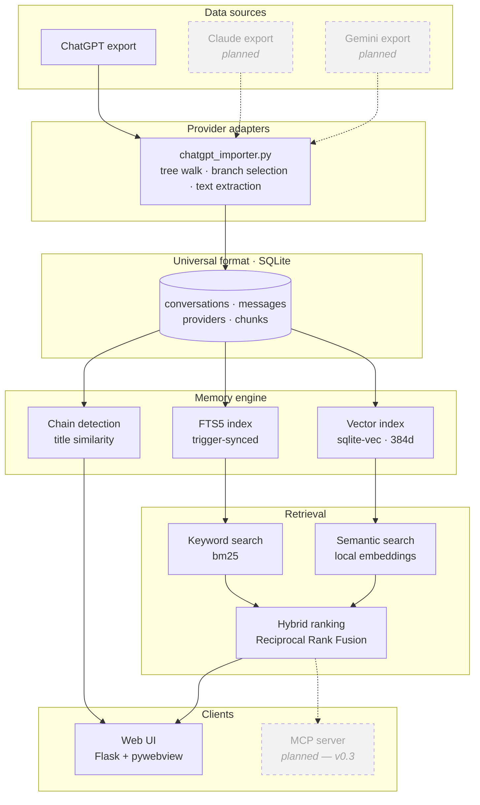

# AI Memory


**A local-first memory layer for your AI conversations. Search everything you
have ever asked — by keyword and by meaning — without any of it leaving your
machine.**

## The problem

*"I remember discussing this. I have no idea which session it was in."*

You worked out a deployment strategy with an assistant three months ago. You
remember the conclusion. You cannot remember the wording, the title, or the
day. So you scroll — and the sidebar only shows titles, most of them
auto-generated and useless. "Project discussion." "New chat." "Untitled."

The conversation is right there. You just cannot find it. Your most useful
thinking is locked in a list you can only search by the one field that carries
the least information.

## The solution

AI Memory imports your exported chat history into a single SQLite file on your
own machine and makes all of it searchable.

Two engines run over it at once. **Keyword search** finds the words you
actually typed. **Semantic search** finds the conversation when you cannot
remember a single word of it — matching on meaning, using embeddings computed
locally. Results are merged, deduplicated, and badged so you can see which
engine found what.

## Demo

Both of these searches return the same conversation — one titled simply
*"Welcome"*, whose text never contains the phrase you searched for:

```
$ search "gym workout"

  Welcome                                             [both]  1 message match
  ChatGPT · 23 Aug 2024 · 4 messages
  "I want to build muscle and start going to the gym. What should my
   workout plan look like for a beginner?"
```

Fair enough — those words are in the text. Now the one keyword search cannot do:

```
$ search "how do I get stronger"

  Welcome                                     [semantic]  39% similar
  ChatGPT · 23 Aug 2024 · 4 messages
  "I want to build muscle and start going to the gym. What should my
   workout plan look like for a beginner?"
```

Not one word of *"how do I get stronger"* appears anywhere in that
conversation. Keyword search returns nothing at all for it. The embedding
knows that getting stronger and building muscle are the same question.

## Why local-first?

Your chat history is not a pile of search queries. It is medical questions,
salary negotiations, code from work, relationship advice, half-formed business
ideas, and things you would not say out loud. It is one of the most revealing
datasets you will ever generate.

So AI Memory is built so that uploading it is not possible, rather than merely
discouraged:

- **No network calls.** The app talks to `127.0.0.1` and nothing else. There
  is no backend, no API key, no account, and nothing to sign in to.
- **Embeddings are computed on your machine.** The model runs locally on CPU.
  Your conversations are never sent to an embedding API. The only network
  request the project ever makes is a one-time ~90 MB model download from
  Hugging Face, and you can see exactly where it happens
  (`backend/core/embeddings.py`).
- **One file you own.** Everything lives in `data/ai_memory.db`. Back it up,
  move it between machines, inspect it with any SQLite browser, or delete it.
  No export step, no proprietary format, no lock-in.
- **No telemetry.** None. Not opt-in, not anonymised, not planned
  ([see the roadmap](ROADMAP.md#not-planned)).

Cloud sync would make some things easier. It is not worth it for this data.

## Features

| | |
|---|---|
| **Content search** | Full-text search across every message body, not just titles. FTS5 with bm25 ranking, Porter stemming, and highlighted snippets. |
| **Semantic search** | Local embeddings find conversations that share no words with your query. Runs on CPU, degrades to keyword-only if unavailable. |
| **Hybrid ranking** | Both engines merged with Reciprocal Rank Fusion, deduplicated by conversation, badged `keyword` / `semantic` / `both`. |
| **Conversation chains** | Related conversations grouped automatically, so a topic you returned to over weeks reads as one thread. |
| **Safe re-import** | Import the same export twice and nothing duplicates. Matched on id, then on content hash, so even a re-generated export is recognised. |
| **Desktop app** | Runs in a native window via pywebview, or in your browser with `--no-window`. |

## Setup

Requires Python 3.10+ (the bundled SQLite must have FTS5, which it does on
every standard CPython build).

```bash
pip install -r requirements.txt
python backend/main.py
```

A desktop window opens on `http://127.0.0.1:5000`.

`sentence-transformers` and `sqlite-vec` are only needed for semantic search,
and pull in PyTorch. If you would rather not install them, everything else
works — the app detects their absence, says so in Settings, and searches by
keyword alone:

```bash
pip install flask pywebview     # keyword-only install
```

Options:

```bash
python backend/main.py --no-window     # serve in the browser instead
python backend/main.py --port 5001     # a different port
python backend/main.py --db path.db    # a different database file
```

If the requested port is busy, a free one is picked automatically.

## Usage

### 1. Get your ChatGPT export

In ChatGPT: **Settings → Data controls → Export data**. You will be emailed a
zip archive; unzip it and find `conversations.json` inside.

### 2. Import it

Open **Import**, then either upload `conversations.json` or paste its path on
disk. Pointing at the path avoids copying the file, which is nicer for large
exports.

Import is idempotent — importing the same file twice imports nothing the second
time. Each conversation is matched first on its ChatGPT id, and a SHA-256 hash
of the transcript decides whether anything actually changed, so re-importing a
newer export only touches what is new or edited. If the id is *not* recognised,
the hash is checked on its own: an export that mints fresh ids each time is
still recognised as the same conversation rather than piling up copies.

Want to try it before exporting your own history? Import the included
`sample_conversations.json`.

### 3. Search

The search box queries conversation titles *and* every message body, by keyword
and by meaning at once. Results show a snippet, the provider, the date, and a
badge saying where the hit came from:

| Badge | Meaning |
|---|---|
| `keyword` | matched the words you typed |
| `semantic` | matched the *meaning*, not the words |
| `both` | found by both, which usually means it is the right answer |

Keyword terms are ANDed together, and `"double quotes"` searches an exact
phrase. Semantic search finds conversations that share no words with your
query at all — searching *"how do I get stronger"* surfaces a conversation
about building muscle and gym routines.

Semantic search can be switched off in **Settings**, which falls back to
keyword-only results.

## Architecture

Provider-specific parsing happens once, at the edge. Everything downstream of
the universal format is provider-agnostic, which is why adding a new assistant
is one file rather than a refactor.



Dashed boxes are on the [roadmap](ROADMAP.md), not built yet.

## How it works

```
ai_memory/
├── backend/
│   ├── core/
│   │   ├── database.py   schema, FTS5 table + sync triggers, queries
│   │   ├── embeddings.py chunking, local embeddings, vector search
│   │   ├── importer.py   import orchestration, chain detection
│   │   └── search.py     FTS5 queries, semantic/keyword fusion
│   ├── providers/
│   │   └── chatgpt_importer.py   parses ChatGPT's export format
│   ├── web/
│   │   ├── app.py        Flask routes
│   │   ├── templates/    Jinja2 pages
│   │   └── static/       stylesheet
│   └── main.py           entry point: Flask thread + pywebview window
├── tests/                four suites, no test framework required
├── data/                 database and saved imports (gitignored)
└── sample_conversations.json
```

### Storage

Core tables — `providers`, `conversations`, `messages`, `conversation_chains`,
`conversation_chain_members` — plus an FTS5 virtual table `conversation_fts`
holding one row per conversation: its title and all of its messages
concatenated. Semantic search adds `chunks`, `embedded_conversations` and the
`chunk_vectors` vector table; `settings` holds the UI toggles.

That index is maintained by triggers rather than by application code, so it
cannot drift out of sync no matter who writes to the database. The FTS row
shares its rowid with the `conversations` row, which lets the triggers find the
right index entry with a rowid lookup instead of a table scan. Inserting a
message appends to the document; updates and deletes rebuild it.

Search is `bm25()`-ranked with title matches weighted above body matches, and
snippets come from FTS5's `snippet()`.

### Semantic search

Messages are chunked, embedded with
[sentence-transformers](https://www.sbert.net/) using **all-MiniLM-L6-v2**
(384 dimensions), and the vectors are stored in a
[sqlite-vec](https://github.com/asg017/sqlite-vec) virtual table — in the same
database file as everything else. No server, no separate vector store, nothing
leaves the machine. The model is ~90 MB and downloads on first use.

Chunking has two rules worth knowing. Chunks never span two messages, so a
question and an unrelated later answer are not blended into one vector. And
chunks are measured in **model tokens, not words**: this model truncates at 256
word-piece tokens, so a 500-token chunk would have half its text silently
ignored by the encoder while still looking indexed. Windows are 220 tokens with
40 of overlap, sliced by character offset so the stored text keeps its original
casing, and snapped out to whole words so no chunk ends mid-word.

Embedding is incremental. Each embedded conversation records the
`content_hash` it was built from, so a re-import only re-embeds what actually
changed, and re-running costs nothing when nothing has.

At query time the two engines run independently and are merged by **Reciprocal
Rank Fusion** — each conversation scores `Σ 1/(60 + rank)` across the lists it
appears in. RRF needs no normalisation between a bm25 rank and a cosine
similarity, which are not on comparable scales, and it naturally rewards
conversations both engines agree on. Results are deduplicated by conversation,
keeping each one's best-matching chunk.

Every layer degrades to keyword-only rather than failing: the toggle being off,
the libraries not installed, the model not downloaded, or nothing embedded yet
all produce the same fallback.

### Parsing ChatGPT exports

A ChatGPT conversation is a *tree*, not a list — every regeneration branches
it. The importer walks up from `current_node` to the root and reverses, which
yields the branch you actually kept and silently drops abandoned regenerations.
It also skips system messages, messages flagged
`is_visually_hidden_from_conversation`, and non-text payloads such as tool
output, while keeping the text half of multimodal (image + text) messages.
Older flat `{"messages": [...]}` exports are handled too, and a conversation
that fails to parse is counted as skipped rather than aborting the import.

### Conversation chains

After each import, conversations are grouped by title similarity: titles are
lowercased, stripped of punctuation and stopwords, and any two conversations
whose remaining words reach an overlap coefficient of 0.5 are linked. Links
merge transitively, so a run of related chats becomes one chain, ordered by
creation date.

The overlap coefficient divides by the *smaller* of the two word sets, so a
short title that is a subset of a longer one scores 1.0 instead of being
penalised for the length difference. *"Sourdough starter troubleshooting"* and
*"Sourdough starter feeding schedule"* share two topical words out of a
three-word minimum, score 0.67, and chain. The comparison against the threshold
is inclusive.

Which words survive matters as much as the arithmetic. Sharing half of a
two-word title means sharing a single word, so the stopword list covers not
only ordinary English filler but generic nouns for the act of having a
conversation — *discussion, talk, advice, thoughts, update, tips*. Those name
the container rather than the subject. Singular and plural are both listed,
since titles are lowercased but never stemmed and "discussions" would
otherwise slip through as a distinct token. *"Project discussion"* and *"Gusto
forecasting discussion"* have only "discussion" in common, so once it is
stripped they share nothing and stay unchained, which is right: one is about
architecture, the other about Prophet seasonality.

It remains a crude heuristic that reads titles and never message bodies —
those two conversations *are* both about Gusto, and nothing in their titles
says so. Expect both false pairs and missed ones. The threshold is a
parameter (`detect_chains(conn, threshold=0.7)` tightens it), `STOPWORDS` in
`backend/core/importer.py` is the other dial, and **Settings → Rebuild
conversation chains** re-runs detection over the whole library.

## Tests

```bash
python tests/run_all.py
```

255 checks across four suites. They run against temporary databases and never
touch `data/`, so running them cannot harm a real library. The two semantic
suites skip themselves with a note if sentence-transformers is not installed.

See [CONTRIBUTING.md](CONTRIBUTING.md) for what each suite covers.

## Limitations

- ChatGPT is the only supported provider.
- Semantic matches are ranked but not thresholded aggressively: a weak match
  (~0.16 cosine) can appear low in the list. It is badged `semantic` and shows
  its similarity, so you can see what it is. `MIN_SIMILARITY` in
  `backend/core/embeddings.py` is the dial.
- The encoder takes several seconds to load. It is preloaded on a background
  thread at launch, so startup stays under a second and searches never block on
  it. A search arriving mid-load returns keyword results with a "Loading
  embedding model…" banner, and the page re-runs itself once the model is
  ready. Preloading is skipped when semantic search is switched off.
- Vector search is exact (brute-force KNN over every chunk), which is fine for
  a personal library but not for millions of chunks.
- Chain detection uses titles only, never message content.
- Import speed is roughly a minute per 45 MB of export (~2,000 conversations),
  because the search index is rebuilt incrementally as each message lands.
- The Flask development server is used deliberately: it is bound to
  `127.0.0.1` and only ever serves this one desktop window.

## Contributing

Contributions are welcome — particularly new provider adapters, which the
architecture is built for. [CONTRIBUTING.md](CONTRIBUTING.md) walks through
writing one, with a worked example.

- [Roadmap](ROADMAP.md) — what is planned, and what is deliberately not
- [Report a bug](.github/ISSUE_TEMPLATE/bug_report.md)
- [Request a feature](.github/ISSUE_TEMPLATE/feature_request.md)

## License

[MIT](LICENSE).
